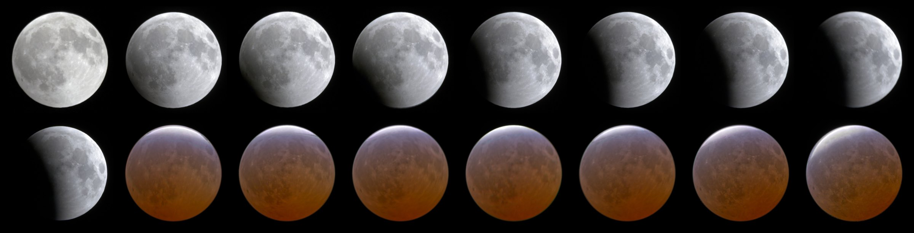
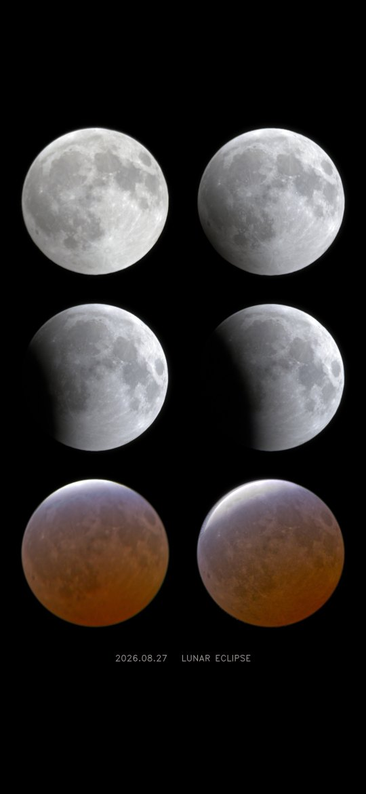
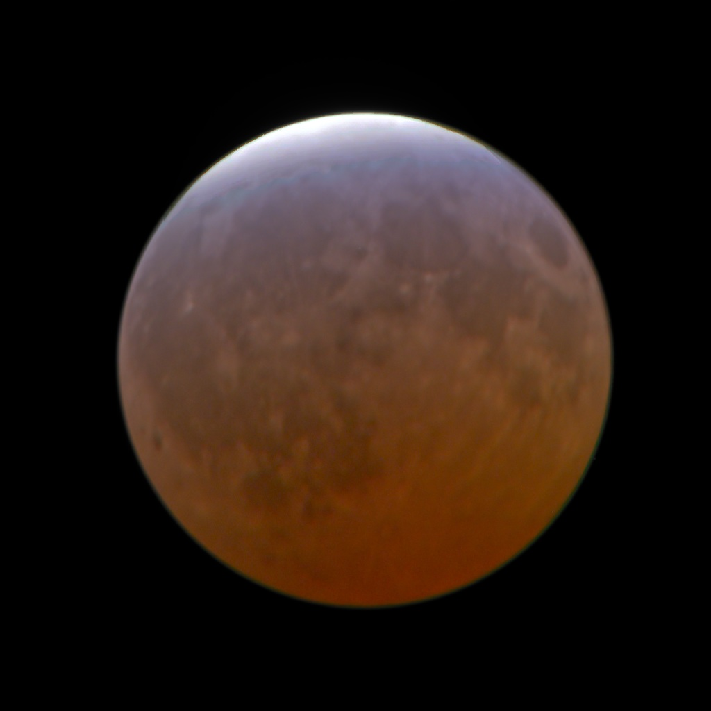
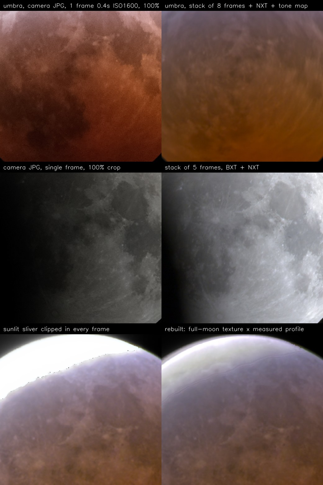

# MoonStack

One-click post-processing for a lunar eclipse shot on a fixed tripod: drop a folder of RAWs in, get one clean image per eclipse phase, a whole-night sequence, phone-format composites, layered Photoshop files and a report that shows which frames were used and why.



Built for — and on — 96 Fuji X-T30 frames of the 2026-08-27 eclipse (300 mm, no tracking, 96 % umbral coverage). Every heuristic in here exists because something went wrong on that data; the [Chinese README](README.zh-CN.md) and [`skills/lunar-eclipse-stacking/`](skills/lunar-eclipse-stacking/) record the reasons.

<p align="center"> &nbsp; </p>

Before / after, all from the same untracked 300 mm frames — a single camera JPG of the umbra vs. the stack, a 100 % crop of a partial phase, and a sunlit sliver that was clipped in every exposure vs. the rebuilt one:



## What it does

```
analyze     decode RAW (rawpy, linear, daylight WB), find the moon disk to sub-pixel accuracy,
            score sharpness / clipping / trailing, cache a crop per frame
group       split the night into phases from physics (sunlit fraction of the disk, exposure
            regime, time window); exposure brackets become their own HDR group; reject soft,
            trailed, shaken and over-clipped frames — but only against frames of similar exposure
stack       chained sub-pixel alignment (phase correlation → coarse-to-fine ECC, limb-radius
            correction for thin slivers, drift model for untracked mounts), photometric
            normalisation in the sensor's linear range, HDR-aware noise-normalised sigma-clip
            stack in radiance units (counts × N² / (t × ISO))
pixinsight  BlurXTerminator + NoiseXTerminator headless (optional)
finish      sunlit-surface white balance, lateral-CA channel alignment, local tone mapping of the
            umbra, soft neutralisation of saturated limbs, rebuild of blown sunlit slivers from the
            registered full-moon texture × a measured penumbral profile, composites, phone layouts
photoshop   layered PSD per phase (stack + sharpen + curves/vibrance layers) and a sequence PSD (optional)
report      self-contained HTML: every frame, its score and its fate
```

## Install

```
pip install -r requirements.txt        # rawpy, opencv-python, scikit-image, tifffile, exifread, Pillow, numpy
```
Optional: PixInsight with RC-Astro BlurXTerminator/NoiseXTerminator, Adobe Photoshop 2025. Paths are in `moonstack/config.py`; the pipeline skips them when absent (`--no-pi --no-ps`).

## Run

```
python run.py                       # full pipeline, ~7 min for 100 × 26 MP frames
python run.py --from stack          # resume from a stage
python run.py --stage finish        # rerun one stage while tuning the look
python -m moonstack.share           # shareable single-file page
```
Put your RAWs (with or without JPG sidecars) in `Eclipse/` or set `input_dir` in `config.json` (copy `config.example.json`). Set `sensor_width_mm` for your camera; everything else adapts from EXIF.

## Outputs

```
output/final/NN_stage_HHMM.tif|jpg   one per phase, 16-bit sRGB
output/final/00_composite.jpg        the whole night in time order
output/final/phone_grid.jpg          6 phases, 2 per row, 1080×2340 (also phone_arc / phone_hero)
output/photoshop/*.psd               layered, plus 00_eclipse_sequence.psd
output/report.html                   frames, scores, keep/reject reasons, alignment stats
output/frames.json, groups.json      machine-readable state of every stage
```

## The parts worth stealing

- **Radiance normalisation with the aperture term.** Mixed-exposure stacks only work if every frame is on one scale; forgetting N² makes f/6.3 and f/13 frames differ by 4.3×.
- **HDR without an HDR step.** Mask clipped pixels, weight by photon SNR, sigma-clip with residuals normalised by each frame's own noise. Bracket ladders and mixed-exposure totality groups merge in the same code path.
- **Registering thin crescents.** ECC slides along a smooth arc. Position the sliver along the arc from a constant-velocity drift model and radially from its limb radius against the reference circle.
- **Radial-ray limb fit with confidence.** Works on the sunlit limb, the faint umbra/sky limb of a long exposure, and tells you when a frame is too thin to trust.
- **Rebuilding a blown sliver honestly.** Texture from the full-moon frame registered onto the disk (field rotation searched), brightness shape from a *measured* penumbral profile. Extrapolating the gradient never worked; a flat plateau looks fake at a glance.

## Claude Code skill

`skills/lunar-eclipse-stacking/SKILL.md` packages the workflow, log-reading guide and pitfalls so an agent can run and tune this pipeline. Install with

```
claude plugin marketplace add <this repo>   # or copy the folder into ~/.claude/skills/
```

## License

MIT.
